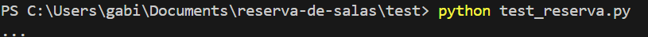
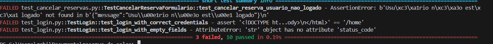
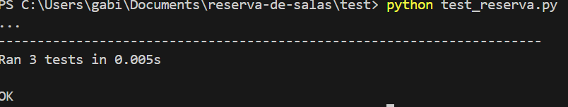
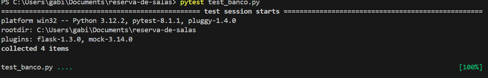
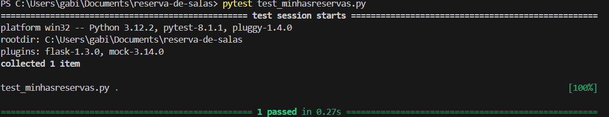
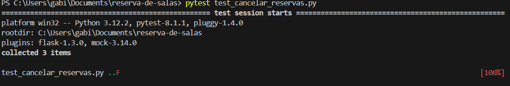

# Documentação dos Testes

## 1. Introdução
Este documento fornece uma visão geral dos testes utilizados no projeto Reservas de salas e explica como eles são escritos, organizados e executados.

## 2. Visão geral dos testes
### Estrutura do projeto
Os testes estão localizados no diretório `test/` do projeto.

### Tecnologias utilizadas
Os testes são escritos em Python usando o framework unittest.

## 3. Tipos de testes
- **Testes unitários:** Testam unidades individuais de código.

## 4. Estrutura dos testes
Os testes são organizados em arquivos Python separados, seguindo a convenção de nomenclatura `test_nome_do_modulo.py`.

## 5. Como executar os testes
Para executar todos os testes, execute o comando `pytest` ou `python` no terminal na raiz do projeto. Caso queira executar um arquivo por vez, coloque o diretório em que o arquivo se encontra e execute o comando.

## 6. Resultados dos testes
Os resultados dos testes são exibidos no terminal, indicando casos de sucesso e falhas. Em caso de falha, informações adicionais são fornecidas para ajudar na depuração.

O resultado do teste é exibido na tela, como mostrado abaixo:

## 7. Resultado do teste de Login

## 8. Resultado do teste de Reserva

## 9. Resultado do teste de Banco

## 10. Resultado do teste Minhas Reservas

## 11. Resultado do teste de Cancelar
